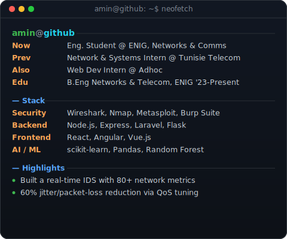

<div align="center">

 

</div>

<div align="center">

[](mailto:amin.makni@outlook.fr)
[](https://makni-amin.bolt.host/)

</div>

<div align="center">



</div>

---

### About

Networks & Telecommunications Engineer passionate about offensive cybersecurity, applied AI, and full-stack development. Focused on network traffic analysis, anomaly detection through Machine Learning, and infrastructure security. Currently seeking a final-year project in information security.

### Featured Projects

- **Autonomous Cybersecurity Detection & Isolation System** — Real-time IDS detecting Nmap scans, DDoS attacks, and botnets via Random Forest classification, with automated isolation of compromised machines. `Python` `PyShark` `Tkinter` `VirtualBox API`
- **QoS Optimization for Telecom Services (VoIP/SMS)** — 60% reduction in jitter/packet loss using DiffServ + Linux tc/netem. `Asterisk` `Kannel` `SIP/RTP` `Wireshark`
- **[Cloud Document Management Platform](https://docup-fr.onrender.com/)** — JWT auth, AWS S3 storage, React + Node/Express microservices. `React` `Node.js` `MongoDB` `AWS S3`
- **Tennis Tournament Management Application** — Reservation system with real-time notifications. `Laravel` `MySQL` `Bootstrap`

### Education & Certifications

- École Nationale d'Ingénieurs de Gabès (ENIG) — Engineering Degree, Communications & Networks *(2023–Present)*
- Cisco Networking Academy — CCNA 1 & CCNA 2
- Oracle — OCI Data Certified Foundations Associate, OCI AI Foundations Associate

---

<sub>This profile is generated, not hand-typed. See <a href="#how-it-works">How it works</a> below.</sub>

## How it works

Two of the three visuals are **static SVGs** — regenerate them locally whenever your photo, role, or skills change:

```bash
pip install pillow numpy opencv-python-headless rembg

# 1. Remove background + boost local contrast (one-time per photo)
python3 scripts/prep_photo.py source-photo.jpg source-prepped.png

# 2. Render the animated "typing" ASCII portrait
python3 scripts/make_ascii_svg.py source-prepped.png assets/ascii-portrait.svg

# 3. Render the animated info card (edit the ROWS list in the script first)
python3 scripts/make_info_card.py
```

The **contribution heatmap** is the only piece that's actually live. `.github/workflows/update-profile-art.yml` runs daily (and on-demand from the Actions tab), scrapes your public contribution calendar straight from `github.com/users/<you>/contributions` — no token or auth required — and re-renders `assets/contrib-heatmap.svg`:

```bash
pip install -r requirements.txt
python3 scripts/fetch_contributions.py   # writes data/contributions.json
python3 scripts/render_heatmap.py        # writes assets/contrib-heatmap.svg
```

All three SVGs use one-shot SMIL/CSS animations (play once on page load, then freeze) — GitHub renders these when the SVG is embedded via ``, even though it doesn't execute JavaScript.
