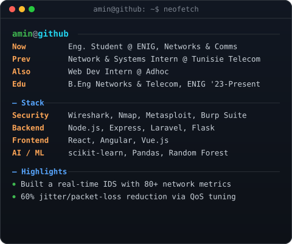

 

---

### About

Networks and Telecommunications Engineering student with hands-on experience across DevOps, cloud infrastructure, and
software testing. Built and deployed distributed systems using Docker, AWS, and CI/CD pipelines through my end-of-
studies project, alongside test automation work covering embedded/protocol-level validation. Motivated to bring a rigorous,
automation-driven approach to software engineering and quality assurance.

### Featured Projects

🚗 CAN Bus Validation Suite (https://github.com/MakniAmin/CAN-BUS-VALIDATION-SUITE)
- Test framework for automotive CAN signal validation: boundary/range testing, fault injection, cross-signal plausibility checks
- Message timing validation to verify signals arrive within their expected period
- Config-driven test structure (YAML-based signal definitions), 29 automated tests with GitHub Actions CI
- Python, python-can, pytest, GitHub Actions
  
🚀 Synthetic Web Monitoring Platform
- Automated browser workflows via Playwright with AI-assisted recording
- Distributed execution with Redis + BullMQ (3 workers, statistical aggregation)
- Real-time performance metrics in InfluxDB with Grafana dashboards
- AI conversational assistant using Mistral AI + MCP
- Full React/Vite interface for workflow management and scheduling
- Production deployment on AWS EC2 with Docker Compose + Nginx
- TypeScript, Playwright, BullMQ, Redis, InfluxDB, Grafana, React, Docker, AWS

🛡️ Autonomous Cybersecurity Detection & Isolation System
- Real-time IDS for Nmap scans, DDoS, botnets via Random Forest
- Automated VM isolation using VirtualBox API
- Python, PyShark, Tkinter, Scikit-learn

📡 QoS Optimization for Telecom Services (VoIP/SMS)
- 60% jitter/packet loss reduction using DiffServ + tc/netem
- Asterisk, Kannel, SIP/RTP, Wireshark

☁️ Cloud Document Management Platform (https://docup-fr.onrender.com/)
- JWT auth, AWS S3 storage, React + Node/Express microservices
- React, Node.js, MongoDB, AWS S3

🎾 Tennis Tournament Management Application
- Reservation system with real-time notifications
- Laravel, MySQL, Bootstrap

### Education & Certifications

- École Nationale d'Ingénieurs de Gabès (ENIG) — Engineering Degree, Communications & Networks *(2023–Present)*
- NVIDIA — Building LLM Applications With Prompt Engineering, Certificate of Competency
- Cisco Networking Academy — CCNA 1 & CCNA 2
- Oracle — OCI Data Certified Foundations Associate, OCI AI Foundations Associate

---

